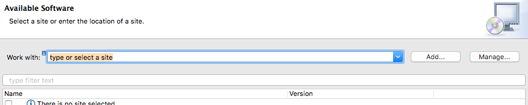
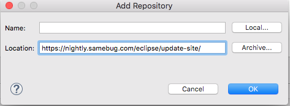
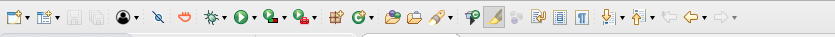

# Samebug Eclipse Plugin User Guide 
*This guide gives the necessary information on how to install and use the Samebug plugin for Eclipse*.

## Getting Started

### Description
Samebug automatically locates relevant solutions to your software crashes from its expert community and solution database.
By searching with a stack trace Samebug can provide you a more relevant solution to your software crashes without having to browse through endless forums and developer communities.

### Prerequisites
Before installing the plugin make sure you sign up for a user account at [Samebug](https://samebug.io/).
The current plugin version is compatible with Eclipse Oxygen.

### Installation 
#### Through the Marketplace
Open the Marketplace wizard in the Eclipse IDE.

Search for Samebug in the search field and click on the "Install" button. Follow the installation steps. 

When prompted with the "Are you sure you want to install..." message dialog, click on "Install Anyway". After the installation, restart your Eclipse.

#### Through the URL
Click on "Install new software" under Help.

Click on the "Add" button, paste the link [https://nightly.samebug.com/eclipse/update-site/](https://nightly.samebug.com/eclipse/update-site/) and click on "OK".

Select the Samebug Feature and click on "Next".

After agreeing to the terms of license, click on "Finish". After the installation, restart your Eclipse.

## Using the Plugin 
  Click on the Samebug icon in the Eclipse toolbar.
  
  
  
  Write your Samebug username and password in the login window and click on the "Login" button.
  
  
  
  After running a file, position your cursor in any line of the exception in the stack trace, right-click and click on search.
  
      

  The available solutions for your exception will show up in the default browser of your system.
